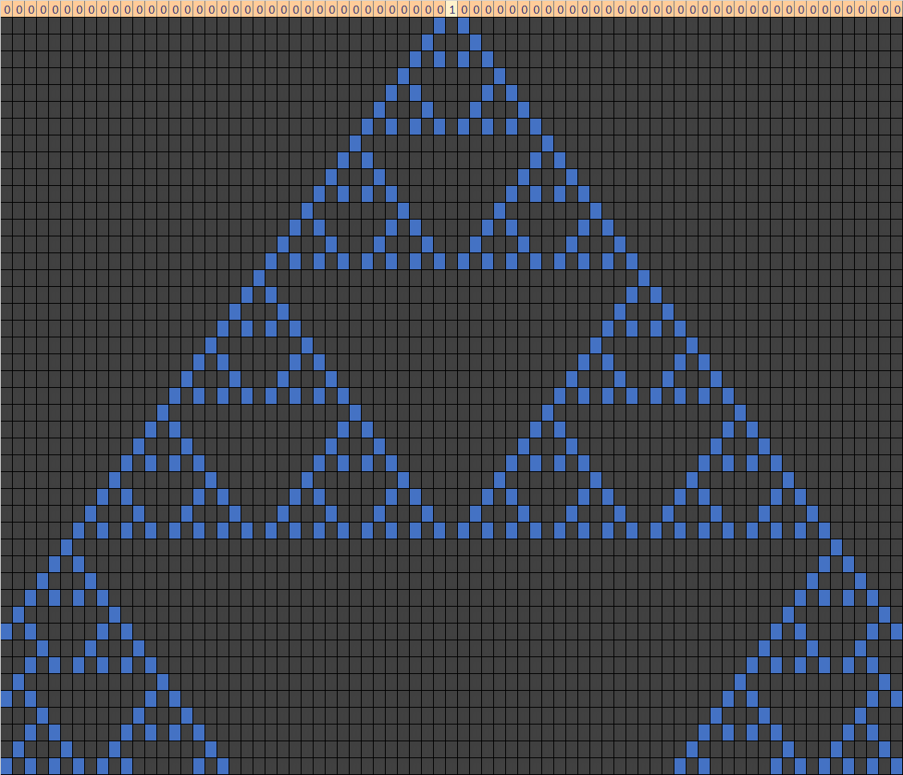
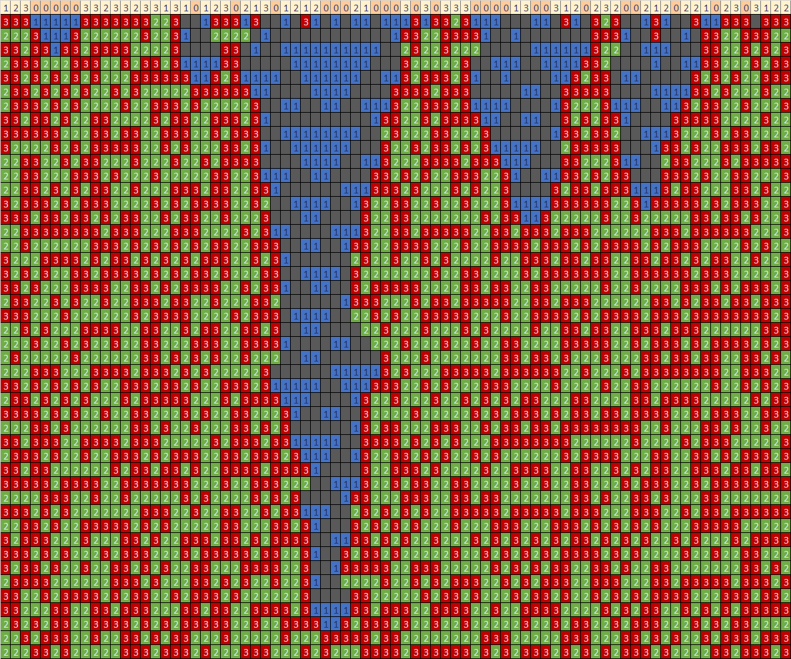

# excellular: Cellular Automata with Excel

This spreadsheet contains two cellular automata: the classic elementary automata described by Stephen Wolfram in _A New Kind of Science_, and a 4-color totalistic automata described by Kenneth E. Perry in the December 1986 issue of BYTE magazine.

The spreadsheet is straigthtfoward to use if you're already familiar with 1-dimensional automata. If not, start your exploration with the following resources and return to the spreadsheet later. Cellular Automata is a beautiful field of science that provides insight into many aspects of the universe and life. No advanced scientific training is required to enjoy the exploration.

* [Algorithmic Beauty: An Introduction to Cellular Automata](https://towardsdatascience.com/algorithmic-beauty-an-introduction-to-cellular-automata-f53179b3cf8f)

* [Abstract Mathematical Art: Use a BASIC program to explore the fascinating world of linear cousins of the Game of Life](https://archive.org/details/eu_BYTE-1986-12_OCR/page/n198/mode/2up)

* [Wikipedia: Cellular automaton](https://en.wikipedia.org/wiki/Cellular_automaton)

* [Stanford Encyclopedia of Philosophy: Cellular Automata](https://plato.stanford.edu/entries/cellular-automata/) (more advanced reading)

Excel is a nice tool for exploring simple automata because of its auto-calculating and conditional formatting features. These features enable the automata to be updated and displayed in real time without the use of programming code. Some useful Excel features include:

* Conditional formatting for coloring cells
* Using VLOOKUP for fetching rules
* Using BITAND and BITRSHIFT for manipulating bits
* Using RANDBETWEEN for randomizing the initial state

There are better tools available but Excel provides a fast way to explore 1-dimensional automata without special software.

### General Tips

* By default each worksheet is locked except for the cells to specify the rule(s) and initial state. If you want to modify the automaton size or algorithm, tap **Unprotect Sheet** on the **Review** toolbar menu.

* If you want to save an image of an automaton, select the desired cells, copy to the clipboard, and then paste into Microsoft Paint. Paint will automatically convert the cells into an image. You can then save as PNG or your desired image format.

* The top row of each automaton specifies the initial state. Permitted values are  0 or 1 for the elementary automata and 0-3 for the totalistic automaton. Conditional formatting is used to highlight non-zero cells so you can easily see which cells have been modified. To change the style, first unprotect the worksheet and then select **Home** -> **Conditional Formatting** -> **Manage Rules** from the toolbar. Select **This Worksheet** from the dropdown menu and look for the rule specifying **Cell Value > 0**. 

* The grid below the initial state contains each successive generation of the 1-dimensional automaton. Each cell state has a different color that is applied with conditional formatting. You can change the style by selecting **Home** -> **Conditional Formatting** -> **Manage Rules** from the toolbar. The elementary automaton has two colors and the totalistic automaton has four colors.

* The left and right boundaries of each grid are wrapped. For example, if an automaton collides with the left side, it will appear on the right side like Pac-Man (and vice versa). This is accomplished with a special column that references the other side. Change the values of these boundary colums to 0 (or another fixed value) if you don't want wrapping.

## Worksheet #1: Elementary Automata

This worksheet implements the classic 1-dimensional elementary cellular automata as described by Stephen Wolf in _A New Kind of Science_. The worksheet has the following features:

* Any rule number (Wolfram Code) from 0 to 255 can be entered and the sheet will automatically re-calculate. For reference, the components of the rule are decoded and shown in a table below the rule number.

* Each cell of the initial state can be set to zero or one. By default the grid has a single 1 near the center as this is a common way of exploring each rule. Change the rule number a few times to see how each one affects evolution of the initial state.

Tip: if you want to explore random initial states, edit the leftmost initial state cell and type =RANDBETWEEN(0,1) and then copy that expression to each cell by dragging the box horizontally. This will put a random 0 or 1 into each cell. You can regenerate the random numbers by tapping _Calculate Now_ on the _Formulas_ toolbar menu.

The Wikipedia article on [Elementary cellular automaton](https://en.wikipedia.org/wiki/Elementary_cellular_automaton) describes a few rule numbers you can try out. Try them all.

## Worksheet #2: Totalistic Sum 4-Color

This worksheet implements a 4-color 1-dimensional totalistic cellular automaton as described in a delightful article by Kenneth E. Perry in the December 1986 issue of BYTE magazine. You can find a PDF copy of the article on the Internet Archive. Be sure to read the article and try the various rules discovered by the author.

* [Abstract Mathematical Art: Use a BASIC program to explore the fascinating world of linear cousins of the Game of Life](https://archive.org/details/eu_BYTE-1986-12_OCR/page/n198/mode/2up)

In this automaton, each cell has four possible states (0, 1, 2, or 3) and the rule for each generation is based on the sum of the cell and its two neighboring cells. This allows for ten possible sums of 0 to 9 (e.g., 000 to 333). You can therefore enter 0-3 for any cell of the initial state, and 0-3 as the result of each of the 10 possible sums.

The sheet is preconfigured to use random values for the initial state. You can regenerate the random values by tapping _Calculate Now_ on the _Formulas_ toolbar menu. Otherwise enter 0, 1, 2 or 3 into each cell.

## Contact

Feel free to add new automata, improve this documentation, etc.

Dave Pinch 
April 25, 2020

* https://linkedin.com/in/davepinch
* https://instagram.com/amberdabber
